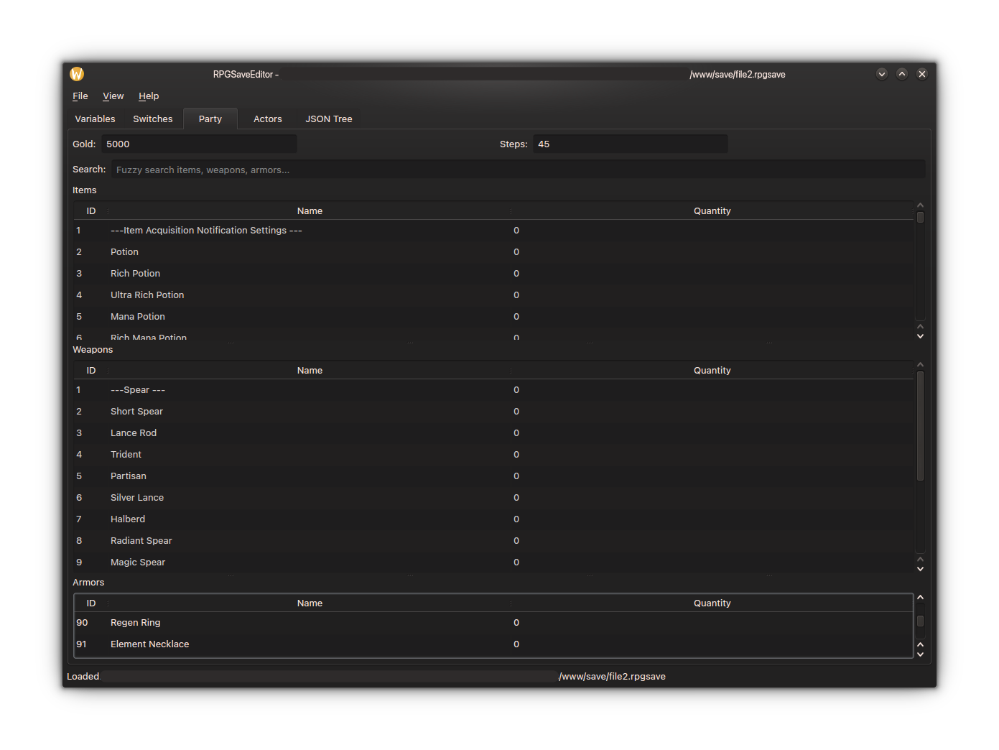

  
  
# RPGSaveEditor

A dead simple RPGMaker save editor, focused on being a local tool you can actually use. Just drag your game folder or save file in, and edit away right at it! 

# Building from source

1. Clone the repo
2. Run `cmake --build build`

## Building on MacOS

### 1. Install dependencies (Qt6 and zlib via Homebrew)
`brew install qt@6`

### 2. Configure CMake (creates the build directory)
`cmake -B build -DCMAKE_PREFIX_PATH="$(brew --prefix qt@6)"`

### 3. Build
`cmake --build build --parallel $(sysctl -n hw.ncpu)`